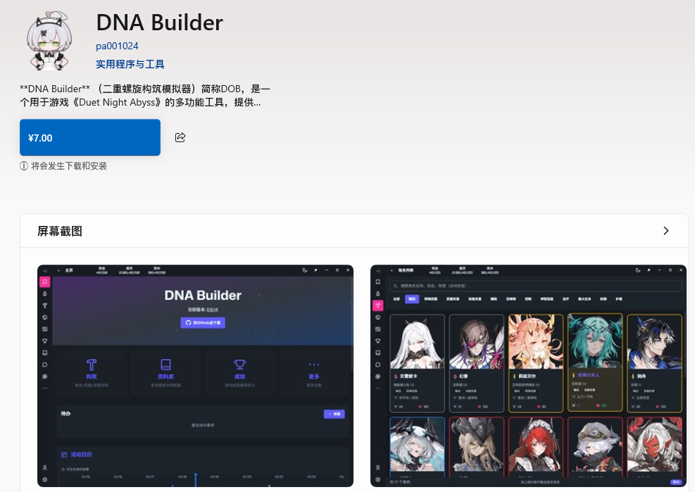

# 二重螺旋构筑模拟器 — Duet Night Abyss Builder (DNA Builder)

<p align="center">
  <a href="https://dna-builder.cn/"></a>
  <a href="https://github.com/pa001024/dna-builder/actions/workflows/alpha.yml"></a>
  <a href="https://github.com/pa001024/dna-builder/stargazers"></a>
  <a href="https://github.com/pa001024/dna-builder"></a>
  
</p>

<p align="center">
  <strong>DNA Builder</strong>（简称 DOB）是面向《二重螺旋 Duet Night Abyss》的一站式综合工具，提供<b>资料检索、角色构建、养成分析与伤害计算</b>能力，帮助玩家高效优化角色配装方案。
</p>

## 使用入口

### 🌐 网页版（支持 PWA）

可直接在浏览器中打开，亦可安装为 PWA 应用，支持离线访问。

| 部署节点 | 链接 |
|---------|------|
| **国内服务器**（推荐） | [https://dna-builder.cn/](https://dna-builder.cn/) |
| EdgeOne 加速节点 | [https://dna-builder.edgeone.dev/](https://dna-builder.edgeone.dev/) |
| Vercel 全球节点 | [https://dna-builder.vercel.app/](https://dna-builder.vercel.app/) |

### 🖥️ 桌面版（推荐体验）

| 安装方式 | 命令 / 链接 |
|---------|-------------|
| **winget** | `winget install pa001024.dna-builder` |
| **微软商店** | [https://apps.microsoft.com/detail/9nk8zw43shb1](https://apps.microsoft.com/detail/9nk8zw43shb1) |
| **GitHub Releases** | [下载最新版本](https://github.com/pa001024/dna-builder/releases/latest) |

> **运行前置**：桌面版依赖 [Microsoft Edge WebView2](https://developer.microsoft.com/zh-cn/microsoft-edge/webview2/)，通常 Windows 10/11 已内置，若未安装请前往下载。



## 功能特点

### 🎯 配装与计算

| 功能 | 说明 |
|------|------|
| **角色构建** | 角色、武器、MOD、BUFF 的可视化配置 |
| **自动构建** | 一键搜索当前条件下的高收益组合 |
| **伤害计算** | 技能与武器伤害期望的实时计算 |
| **目标函数** | 支持自定义表达式优化 |

### 📦 数据管理

| 功能 | 说明 |
|------|------|
| **库存管理** | 支持武器与 MOD 的库存记录与筛选 |
| **拼音搜索** | 快速检索角色、武器与 MOD |

### 🎮 模拟工具

| 功能 | 说明 |
|------|------|
| **钓鱼模拟器** | 内置鱼类与钓点相关数据 |
| **密函模拟器** | 内置密函数据与模拟流程 |
| **成就系统** | 记录与跟踪成就进度 |

### 🤖 扩展集成

| 功能 | 说明 |
|------|------|
| **MCP Server** | 支持 AI 工具集成，可供第三方客户端调用 |

## 技术栈

### 前端

| 技术 | 用途 |
|------|------|
| **Vue 3** + **TypeScript** | 核心框架，组合式 API + 严格类型安全 |
| **Vite 7** | 构建工具与开发服务器 |
| **Tailwind CSS v4** + **daisyUI v5** + **reka-ui** | 样式框架与 UI 组件库 |
| **Pinia** + **Vue Router** | 状态管理与路由 |
| **i18next** | 国际化（支持多语言） |
| **Vitest** + **Biome** | 单元测试与代码质量工具 |

### 桌面应用

| 技术 | 用途 |
|------|------|
| **Tauri 2**（Rust + WebView2） | 跨平台桌面壳，将 Web 应用打包为原生桌面应用 |

### 服务端（可选，用于数据同步）

| 技术 | 用途 |
|------|------|
| **Bun** + **Elysia** | 运行时与 Web 框架 |
| **SQLite** + **Drizzle ORM** | 数据库与 ORM |
| **GraphQL Yoga** | GraphQL API 网关 |

## 多语言

目前支持（含部分数据翻译）：

- 中文（简体 / 繁体）
- English
- 日本語
- 한국어

欢迎提交翻译改进。

## 开发说明

### 环境要求

- Node.js（建议 20+）
- `pnpm`（项目使用 `pnpm`）
- `bun`（用于 server 与工具脚本）
- Rust 工具链（开发 Tauri 时需要）

### 前端

```bash
# 安装依赖
pnpm install

# 本地开发（默认 http://localhost:1420/）
pnpm dev

# 代码检查（Biome + vue-tsc）
pnpm lint

# 单元测试
pnpm test

# 代码格式化
pnpm format
```

### 桌面应用（Tauri）

```bash
pnpm tauri dev
pnpm tauri build
```

### 服务端（Bun + Elysia）

```bash
cd server
bun install

# 开发模式（含迁移）
bun run dev

# 生成迁移
bun run gen

# 执行迁移
bun run mig
```

## 支持作者

如果这个项目对你有帮助，欢迎支持：

- 爱发电: [https://afdian.com/a/pa001024](https://afdian.com/a/pa001024)
- 微软商店购买: [https://apps.microsoft.com/detail/9nk8zw43shb1](https://apps.microsoft.com/detail/9nk8zw43shb1)

## 贡献

欢迎提交 Issue 与 Pull Request。

## 许可证

MIT License

## 联系方式

如有问题或建议，请在 GitHub 仓库提交 Issue。

## Star History

<a href="https://www.star-history.com/?repos=pa001024%2Fdna-builder&type=date&legend=top-left">
 <picture>
   <source media="(prefers-color-scheme: dark)" srcset="https://api.star-history.com/chart?repos=pa001024/dna-builder&type=date&theme=dark&legend=top-left&sealed_token=OAGuTBaAFMhYqJEmvyMFfw_-HtnyqVLaDjS6FPVAUA6h17jqW8GD4U8tw709lMLpDESq5BnlFa5jKhHlFUMOCkd87Y9BGrV17n_1wCqU8IbfjGPaB2dmVUImQWtmSKtc5ynwEb7JN98eWPgUc-I6380tEU35kR_gQbKFOIcLCzhEa88JAhdukg0WXC9Y" />
   <source media="(prefers-color-scheme: light)" srcset="https://api.star-history.com/chart?repos=pa001024/dna-builder&type=date&legend=top-left&sealed_token=OAGuTBaAFMhYqJEmvyMFfw_-HtnyqVLaDjS6FPVAUA6h17jqW8GD4U8tw709lMLpDESq5BnlFa5jKhHlFUMOCkd87Y9BGrV17n_1wCqU8IbfjGPaB2dmVUImQWtmSKtc5ynwEb7JN98eWPgUc-I6380tEU35kR_gQbKFOIcLCzhEa88JAhdukg0WXC9Y" />
   
 </picture>
</a>
